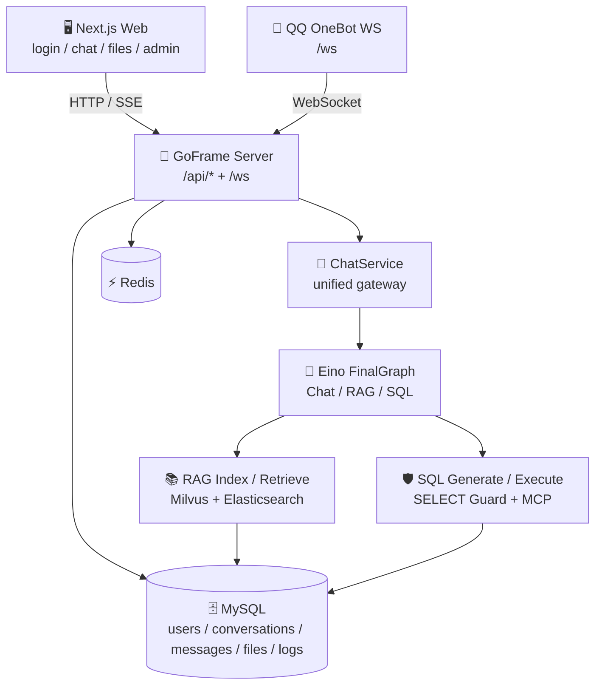
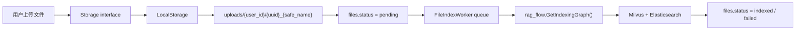

<div align="center">

# 🤖 QQQAI

**面向 QQ 与 Web 的多端智能 Agent 平台**

基于 **GoFrame + CloudWeGo Eino + OneBot + RAG + SQL Agent** 构建，QQQAI 将 QQ 机器人、Web 聊天控制台、文件知识库问答、SQL 生成与安全执行统一到同一套 Agent 核心中，让多端对话、知识检索和数据分析都可以稳定、可扩展地运行。

<p>
  
  
  
  
  
</p>

<p>
  <a href="#-核心特性">核心特性</a> ·
  <a href="#-系统架构">系统架构</a> ·
  <a href="#-快速开始">快速开始</a> ·
  <a href="#-接口概览">接口概览</a> ·
  <a href="#-项目亮点">项目亮点</a>
</p>

</div>

---

## ✨ 核心特性

| 能力 | 说明 |
|---|---|
| 💬 多端聊天 | 同时支持 QQ OneBot 与 Web Chat，两端复用统一 `ChatService`。 |
| 🧠 Agent 编排 | 基于 CloudWeGo Eino `FinalGraph` 自动路由普通聊天、RAG 与 SQL 分析。 |
| 📚 文件知识库 | Web 端上传文件后异步索引，支持 Milvus 向量检索与 Elasticsearch 关键词检索。 |
| 🔎 RAG 问答 | 文件解析、切分、索引、召回与 RRF 融合排序形成完整知识库链路。 |
| 🛡️ SQL 安全执行 | SQL 先生成、后确认、再执行；服务端强制 SELECT 白名单与行数限制。 |
| ⚡ 高并发调度 | 使用 goroutine、channel、worker pool 管理聊天任务与文件索引任务。 |
| 🖥️ 管理后台 | 提供用户、会话、文件、模型调用等统计与管理接口。 |

## 🧭 项目定位

QQQAI 不是一个简单的聊天机器人，而是一个可扩展的多端 AI 助手系统：

- **QQ 场景**：通过 NapCat / OneBot WebSocket 接入 QQ 群聊和私聊，保留 `/ws` 能力。
- **Web 场景**：通过 GoFrame Web API + Next.js 前端提供登录、会话、聊天、文件上传、RAG 索引、SQL 工具和管理员统计。
- **Agent 核心**：通过 CloudWeGo Eino `FinalGraph` 在普通聊天、RAG、SQL 分析之间自动路由。
- **工程能力**：通过 worker pool 控制多用户 AI 请求和文件索引任务，避免高并发下服务被打爆。

## 🏗️ 系统架构



### 核心链路

```text
Web 用户消息  -> Next.js -> /api/chat 或 /api/chat/stream -> ChatService -> FinalGraph
QQ 用户消息   -> OneBot /ws -> handler -> ChatTaskPool -> ChatService -> FinalGraph
文件上传      -> /api/files/upload -> LocalStorage -> FileIndexWorker -> RAG IndexingGraph
SQL 工具      -> /api/sql/generate -> 用户确认 -> /api/sql/execute -> SELECT 安全检查 -> MCP 执行
```

## 🧰 技术栈

### 后端

- **Go 1.25+**
- **GoFrame v2**：Web API、路由、中间件与服务组织。
- **CloudWeGo Eino**：Agent Graph、RAG Flow 与工具编排。
- **gorilla/websocket**：OneBot WebSocket 接入。
- **MySQL**：用户、会话、消息、文件与调用日志持久化。
- **Redis**：缓存与运行时辅助能力。
- **Milvus + Elasticsearch**：向量检索、关键词检索与混合召回。
- **MCP MySQL Server**：SQL Agent 工具调用。
- **JWT + bcrypt**：用户认证与密码安全存储。

### 前端

- **Next.js App Router**
- **React 19**
- **TypeScript**
- **SSE / Streaming Response**
- **lucide-react**

### AI / RAG

- Eino `FinalGraph`
- RAG Chat Flow
- RAG Indexing Graph
- Milvus 向量检索
- Elasticsearch 关键词检索
- RRF 融合排序

## 🚀 快速开始

### 1. 准备环境变量

```bash
cp .env.example .env
```

编辑 `.env`，配置模型、MySQL、Redis、Milvus、Elasticsearch、JWT、管理员账号与 OneBot 相关参数。

### 2. 初始化数据库

项目使用 MySQL 持久化 Web 用户、会话、消息、文件和模型调用日志。

```bash
mysql -h 127.0.0.1 -P 3306 -u root -p qqqai < manifest/schema.sql
```

管理员账号会在后端启动时根据 `.env` 自动创建或更新：

```env
ADMIN_EMAIL=admin@example.com
ADMIN_PASSWORD=change-me
```

### 3. 启动后端

```bash
go run .
```

默认后端地址：

```text
http://127.0.0.1:8080
```

### 4. 启动前端

```bash
cd web
npm install
npm run dev
```

默认前端地址：

```text
http://localhost:3000
```

前端通过以下环境变量访问后端：

```env
NEXT_PUBLIC_API_BASE_URL=http://localhost:8080
```

## 💬 QQ OneBot 接入

QQ OneBot 接入保留原有 `/ws` 路由。后端启动后，NapCat / OneBot 连接：

```text
ws://127.0.0.1:8080/ws
```

`.env` 示例：

```env
BOT_QQ=你的机器人QQ号
BOT_PORT=8080
WEBSOCKET_ALLOWED_ORIGINS=*
WEBSOCKET_READ_TIMEOUT=300
WEBSOCKET_WRITE_TIMEOUT=10
NAPCAT_HTTP_BASE_URL=http://127.0.0.1:3000
```

群聊中需要 **@ 机器人** 后才会触发处理；私聊会直接处理。OneBot 端不会绕过 Web 端能力，而是与 Web 端一样复用 `ChatService` 与 `FinalGraph`。

## 📚 文件上传与 RAG 索引

Web 端支持上传文件：

```text
POST /api/files/upload
```

文件处理流程：



设计重点：

1. 上传接口只负责保存文件和提交索引任务，不阻塞等待完整索引完成。
2. `FileIndexWorker` 使用 goroutine + channel + worker pool 控制索引并发。
3. 单个文件索引失败只更新该文件 `files.status=failed`，不会影响其他任务。
4. 文件存储抽象为 `Storage interface`，当前实现为 `LocalStorage`。
5. 后续可以扩展为 MinIO、OSS、S3 等对象存储，只需要替换 Storage 实现。

## 🛡️ SQL 安全执行机制

SQL 分为两个阶段：

```text
/api/sql/generate
  -> 只生成 SQL
  -> 返回给用户确认

/api/sql/execute
  -> 要求 confirm=true
  -> 服务端安全检查
  -> 包装 LIMIT
  -> 调用 MCP MySQL 工具执行
```

安全规则：

- 只允许单条 `SELECT`。
- 拒绝多语句。
- 剥离 SQL 注释后再检查。
- 拒绝危险关键字：`INSERT`、`UPDATE`、`DELETE`、`DROP`、`ALTER`、`TRUNCATE`、`CREATE`、`GRANT`、`REVOKE`、`CALL`、`LOAD`、`OUTFILE`、`DUMPFILE`、`FOR UPDATE`。
- 执行前统一包装行数限制：

```sql
SELECT * FROM (<user_select_sql>) AS qqqai_safe LIMIT SQL_MAX_ROWS
```

行数上限由 `.env` 控制：

```env
SQL_MAX_ROWS=100
```

这个设计保证模型不能直接执行写操作，也不能绕过后端确认和 SELECT 白名单。

## ⚙️ Go 工程设计

### 高并发对话调度

`ChatTaskPool` 基于 goroutine + channel 实现：

```text
QQ/Web 请求 -> ChatTask -> channel queue -> worker goroutines -> ChatService -> FinalGraph
```

优势：

- 控制多用户 AI 请求并发，避免瞬时请求打爆模型服务。
- channel 队列满时可以快速返回错误。
- worker 数量可配置：

```env
CHAT_WORKER_COUNT=4
CHAT_QUEUE_SIZE=64
```

### 长连接流式输出

Web 聊天流式接口：

```text
POST /api/chat/stream
```

它使用 SSE / Streaming Response 将 AI 回复增量推给浏览器：

```text
ChatService.Stream() -> chunk channel -> SSE data event -> 浏览器实时追加显示
```

同时 handler 会监听 request context，在客户端断开时及时停止写入并结束流式响应。

### RAG 文件并发索引

文件上传后不会同步阻塞索引，而是进入 `FileIndexWorker`：

```text
FileIndexTask -> channel queue -> worker pool -> RAG IndexingGraph
```

优势：

- 多文件上传时可控并发。
- 大文件索引不会阻塞 Web 请求。
- 失败状态可持久化到 MySQL。

配置：

```env
FILE_INDEX_WORKER_COUNT=2
FILE_INDEX_QUEUE_SIZE=32
```

### 存储扩展

文件存储层使用接口：

```go
type Storage interface {
    Save(ctx context.Context, userID int64, file *multipart.FileHeader) (*StoredFile, error)
    Delete(ctx context.Context, path string) error
}
```

当前实现：

```text
LocalStorage -> uploads/
```

后续扩展：

```text
MinIOStorage
S3Storage
OSSStorage
```

业务层不关心文件最终存储在哪里，只依赖 `Storage interface`。

### 多端统一

Web 端和 QQ OneBot 端共用：

```text
ChatService -> Eino FinalGraph -> Chat / RAG / SQL
```

这意味着：

- Web 和 QQ 使用同一套意图识别。
- Web 和 QQ 使用同一套 RAG 问答。
- Web 和 QQ 使用同一套 SQL Agent 核心。
- 后续修改 Agent 能力时不需要分别维护两套逻辑。

## 🧪 运行检查

后端测试：

```bash
go test ./...
```

前端构建：

```bash
cd web
npm run build
```

## 🔌 接口概览

### Auth

| Method | Path | 说明 |
|---|---|---|
| `POST` | `/api/auth/register` | 注册 |
| `POST` | `/api/auth/login` | 登录并返回 JWT |
| `GET` | `/api/auth/me` | 获取当前用户 |

### Conversations

| Method | Path | 说明 |
|---|---|---|
| `POST` | `/api/conversations` | 创建会话 |
| `GET` | `/api/conversations` | 会话列表 |
| `GET` | `/api/conversations/{id}/messages` | 消息列表 |
| `DELETE` | `/api/conversations/{id}` | 删除会话 |

### Chat

| Method | Path | 说明 |
|---|---|---|
| `POST` | `/api/chat` | 普通 Web 聊天 |
| `POST` | `/api/chat/stream` | SSE 流式聊天 |

### Files

| Method | Path | 说明 |
|---|---|---|
| `POST` | `/api/files/upload` | 上传文件并提交 RAG 索引 |
| `GET` | `/api/files` | 文件列表 |
| `DELETE` | `/api/files/{id}` | 删除文件记录和本地文件 |

### SQL

| Method | Path | 说明 |
|---|---|---|
| `POST` | `/api/sql/generate` | 生成 SQL，不执行 |
| `POST` | `/api/sql/execute` | 安全检查后执行 SELECT |

### Admin

| Method | Path | 说明 |
|---|---|---|
| `GET` | `/api/admin/stats` | 管理员统计 |
| `GET` | `/api/admin/users` | 用户列表 |
| `GET` | `/api/admin/conversations` | 会话列表 |
| `GET` | `/api/admin/files` | 文件列表 |

### OneBot

| Method | Path | 说明 |
|---|---|---|
| `GET` | `/ws` | OneBot WebSocket 连接 |

## 🖥️ 前端页面

Next.js 前端位于 `web/`。

| 页面 | 说明 |
|---|---|
| `/login` | 用户登录，成功后保存 JWT。 |
| `/register` | 用户注册。 |
| `/chat` | Web 聊天页，包含会话列表、消息区、SSE 流式回复。 |
| `/files` | 文件上传、文件列表、索引状态展示、删除文件。 |
| `/admin` | 管理员统计页面，展示用户数、会话数、消息数、文件数、模型调用数等。 |

前端请求统一通过 `web/lib/api.ts`：

- 自动附带 Bearer Token。
- 统一处理后端 `{code,message,data,request_id}` 响应。
- 401 时清理 token 并跳转登录。
- `streamChat()` 使用 Fetch Streaming 读取 SSE chunk 并实时追加到消息区。

## 🌟 项目亮点

- **统一 Agent 核心**：Web 与 QQ OneBot 共用 `ChatService` 和 Eino `FinalGraph`。
- **高并发调度**：`ChatTaskPool` 使用 goroutine + channel 控制 AI 请求并发。
- **流式体验**：SSE / Streaming Response 支持 Web 端 AI 回复实时增量显示。
- **异步知识库索引**：`FileIndexWorker` 使用 worker pool 异步执行索引任务。
- **SQL 安全边界**：强制 SELECT 白名单、危险关键字过滤、确认后执行和最大行数限制。
- **存储可扩展**：`Storage interface` 当前接 LocalStorage，后续可平滑扩展 MinIO / S3 / OSS。

## 📌 后续规划

- [ ] 增加 Docker / Docker Compose 一键启动。
- [ ] 增加更多文件类型解析与索引能力。
- [ ] 增加产品截图到 `docs/images/`。
- [ ] 增强管理员后台的调用链路与成本统计。
- [ ] 支持更多 IM 平台或机器人适配器。

---

<div align="center">

**QQQAI · Build once, chat everywhere.**

</div>
